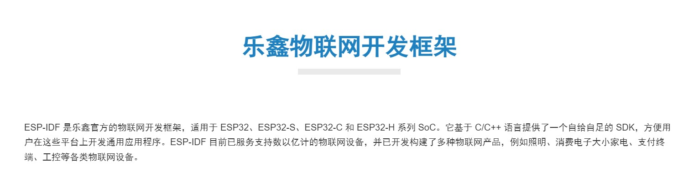
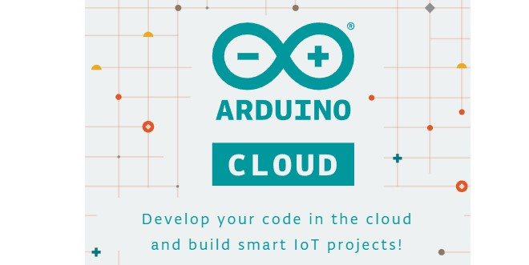
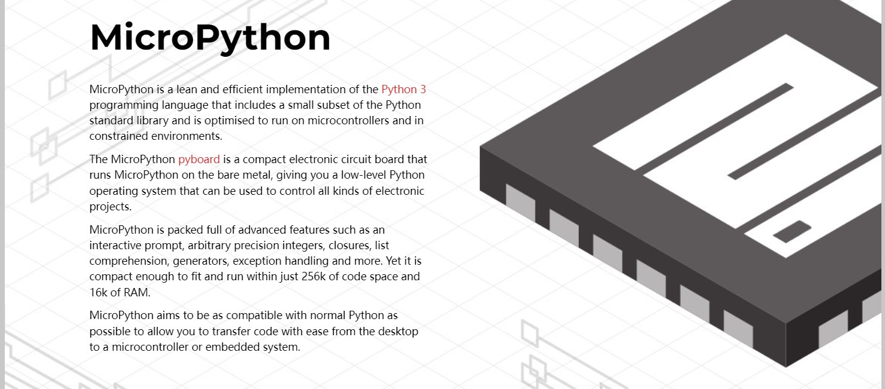

## DuRuofu's ESP32 study notes

这是DuRruofu的ESP32学习笔记,记录个人学习过程中的感悟与总结,现在的时间是2022年11月9日 ，目前市面上常见的开发框架有如下三个，我将会逐一学习。

ESP32开发方式主要分为以下三种：

1. 使用官方工具链进行开发

   使用vscode或者官方esp-id编写代码，使用configuratioin menu 配置编译的属性，使用openOCD调试代码，最后使用windows命令行或者powershell进行代码的上传。使用该方法开发的优点在于，能够实现对esp32最底层的开发控制，缺点是开发不是非常的方便。而且windows上编译上传速度很慢。linux系统上比较快。windows用户通过安装虚拟机的方法，用linux环境进行开发。
   

2. 使用arduino工具链进行开发

   这种方法开发速度比较快，arduino 生态有丰富的第三方库资源可以调用。配合platformio平台，可以有效的降低开发难度和加快开发速度。唯一的缺点arduino开发不够底层，无法掌控程序的细节。

   

3. 使用micropython进行开发

   MicroPython是 Python 3语言 的精简高效实现 ，包括Python标准库的一小部分，经过优化可在微控制器和受限环境中运行。使用python可以极大提高编程效率，但是运行效率不及以C、C++编写的程序，且micropython资料教程并不如前面两者丰富和成熟。

ESP32相关资料：

https://www.espressif.com/zh-hans/products/socs/esp32/resources

`notes`中将存放我的笔记，`code`中将存放我的代码。