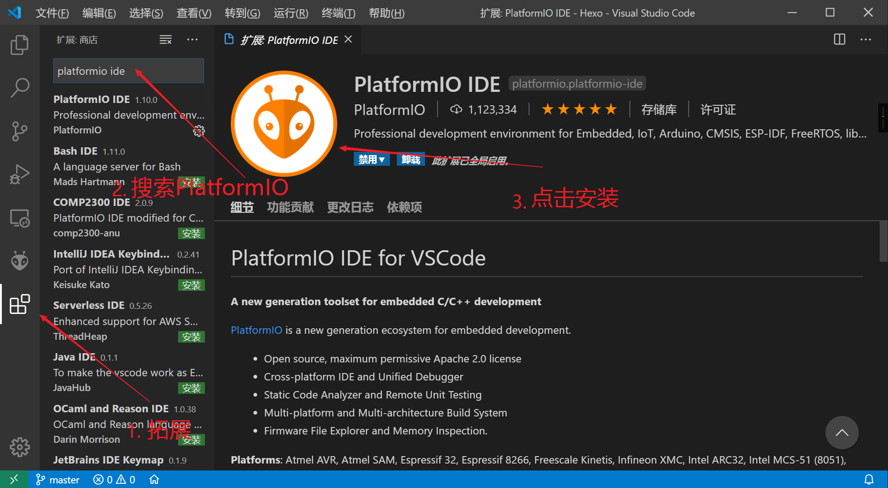
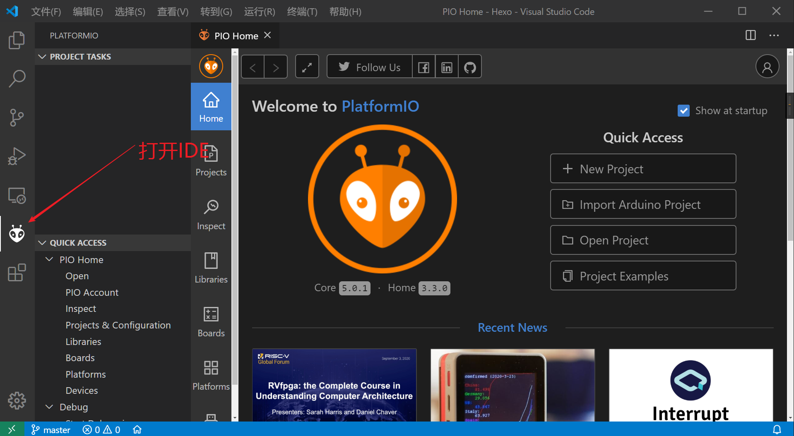
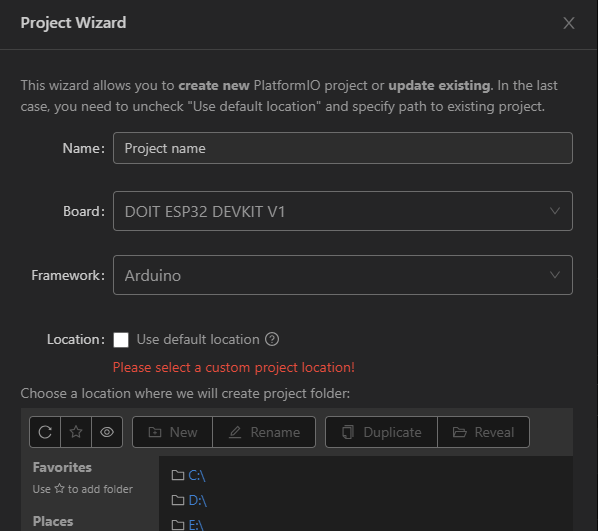
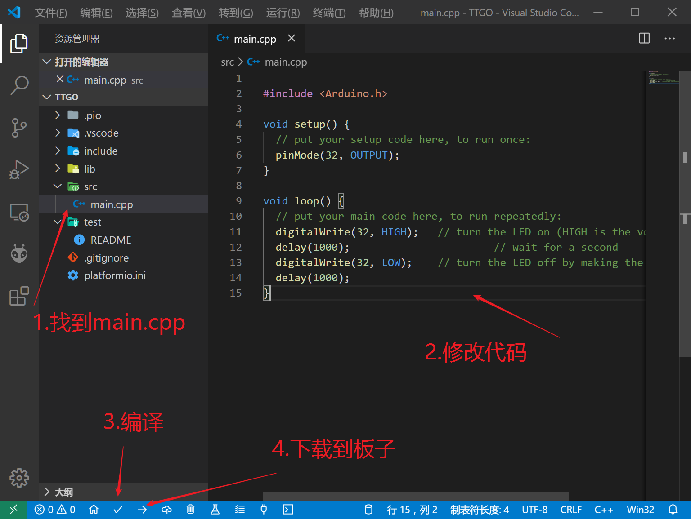

## ESP32开发环境搭建

### Arduino

#### 配置环境

##### 安装 VSCode + PlatFormIO IDE

首先是VScode的安装，比较简单，直接去[官网](https://code.visualstudio.com/)下载安装即可。完成以后启动VScode，在拓展页面直接搜索Platformio IDE，并且安装即可。具体操作如图：



安装完成并且重新启动VSCode以后，拓展那一栏有一个外星人样子的图标，活着看左下角error和waring的右边出现一个小房子的小图标，这个就是PlatformIO IDE的主页，这样就表示安装好了。


##### 测试

- 选择New Project创建工程，选择相应的Board，我这里使用DOIT ESP32 DEVKIT V1，输入ESP32找到对应的Board

- 选择Framework是Arduino，选择保存路径，等待工程完成需要一点时间.

- 完成，打开工程文件夹，找到目录src下的main.cpp并修改如下：

- 
  

  ```
  #include <Arduino.h>
   
  void setup() {
    // put your setup code here, to run once:
    pinMode(32, OUTPUT);
  }
  
  void loop() {
    // put your main code here, to run repeatedly:
    digitalWrite(32, HIGH);   // turn the LED on (HIGH is the voltage level)
    delay(1000);                       // wait for a second
    digitalWrite(32, LOW);    // turn the LED off by making the voltage LOW
    delay(1000);
  }
  ```

- 编译与下载同样左下角有一堆按钮,如上图可以看到相应的按钮

- 选择upload即可完成下载，GPIO32引脚电平翻转，可以看到我们连端口都没有选择就完成了下载的工作，PlatformIO IDE自动扫描串口设备，非常方便。

- Arduino IDE有库管理功能，可以下载到需要的库，就不具体讲了。

> 转载自：https://homepea.top/2020/31.ESP32-Introduce/  （怕链接失效就自己复制一份了 ）

##### 参考视频：

>【ESP32超详细教程-使用VSCode（基于Arduino框架）】
> https://www.bilibili.com/video/BV1tv411w74d/?share_source=copy_web&vd_source=a506554ed4d5f4c4e1ea9e76714fcd74

### ESP-IDE官方工具链

官方教程：

>本文档旨在指导用户搭建 ESP32 硬件开发的软件环境。
>https://docs.espressif.com/projects/esp-idf/zh_CN/release-v4.1/get-started/index.html

参考视频：

>【基于ESP_IDF的ESP32教程】 
>https://www.bilibili.com/video/BV1uf4y177yL/?share_source=copy_web&vd_source=a506554ed4d5f4c4e1ea9e76714fcd74
>
>https://www.micro-studios.com/cn/

### MicroPython

参考视频：

>【Python+ESP32 快速上手（持续更新中） wifi 蓝牙 智能控制 单片机】
> https://www.bilibili.com/video/BV1G34y1E7tE/?share_source=copy_web&vd_source=a506554ed4d5f4c4e1ea9e76714fcd74

